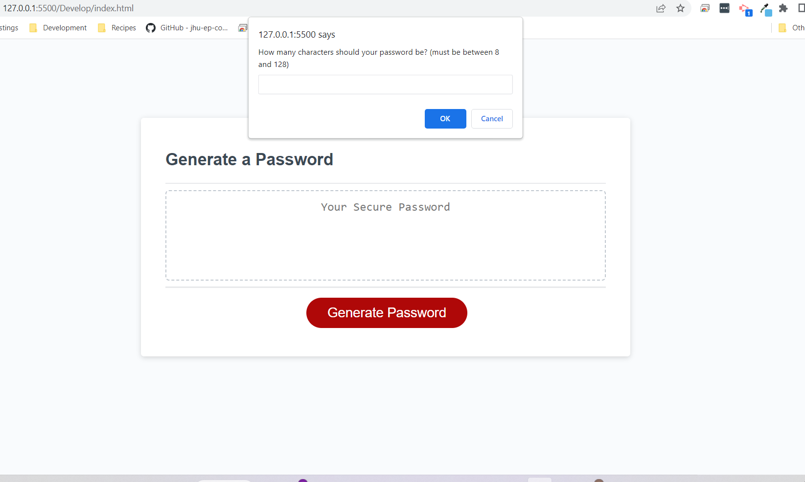

# <Password-Generator>

## Description

This application is a random password generator. The user will go through a set of prompts to add some customization to their final password. Once the prompts are answered appropriately and completed, the user will be given a unique, randomly-assorted password for their use. 

## Usage

When you first enter the application the user will see a button labled "Generate Password." The user can click on this button, which then then bring up a prompt which has a text input to put the amount of characters the user would like their password to be. There is text in the prompt which advises the user to choose between 8 and 128 characters. If the user types any number outside of that range, they will be alerted with a message that tells them so and will have to start the process over. Once the user has selected their character amount they will be directed to a sequence of other prompts where they will either click "ok" if they would like to include the character types, or "cancel" if they do not wish to have those character types in the final password. After going through these prompts a new and unique password will appear in the text box above the "Generate Password" button. The user will be able to copy and paste the password within the text box and use it as their own. 

# Credits

https://developer.mozilla.org/en-US/docs/Web/JavaScript/Reference/Global_Objects/Math/random

https://dev.to/